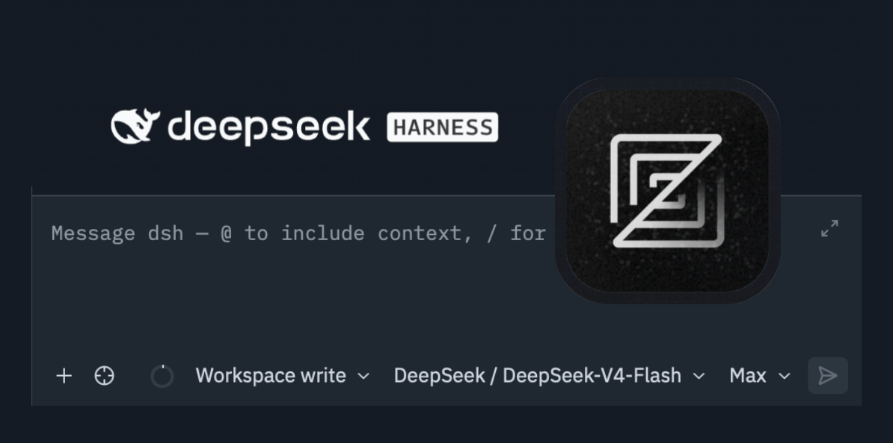

# dsh-acp



> [简体中文](docs/README.zh.md) · [技术文档 / Technical notes](docs/technical.md)

An **Agent Client Protocol (ACP)** server for [DeepSeek Harness](https://github.com/deepseek-ai/deepseek-harness) (`dsh`) that lets [Zed](https://zed.dev) and other editors drive dsh agents over **JSON-RPC 2.0 stdio**.

The shipped dsh `acp` profile is intentionally automation-only. This bundle is a drop-in replacement for its bridge: it keeps the standard automation surface (sessions, MCP, model selection, permissions) and adds the editor experience Zed needs on top.

## Introduction

`dsh-acp` mounts one ACP server on dsh stdin/stdout. Zed launches `dsh --profile acp`; the plugin translates `session/*` requests into dsh Agent lifecycles. Installing this bundle requires no Zed configuration change because it disables both the shipped `acp` bridge and startup row, then mounts this implementation and the same stdin-lifetime provider under unique ids.

## Features

- **Standard ACP lifecycle** — `initialize`, `session/new`, `session/list`, `session/resume`, `session/close`, `session/prompt`, and `session/cancel`
- **Editor history extensions** — `session/load` replays durable history; `session/delete` closes a live session and removes its persisted artifact when the backend exposes deletion
- **Token & thinking streaming** — `agent/assistant-stream` frames projected as `agent_message_chunk` / `agent_thought_chunk`
- **Tool cards** — `tool_call` / `tool_call_update` with kind, file location and line
- **Structured diffs** — native tool hunks plus before/after file snapshots
- **Bash terminal** — command output rendered as terminal content with exit code
- **Context-usage ring** — `usage_update` (used / size)
- **Todo list** — dsh `todo_write` snapshots rendered as the stable ACP `plan` update
- **Images** — ACP image prompts admitted through the durable attachment seam; capability advertised when any selectable route supports images, and the exact pinned route is validated per prompt
- **Slash commands** — dsh commands advertised through `available_commands_update`; recognized commands stay in the command plane and receive typed image attachments
- **Ask the user** — dsh's scoped `user-questions/request` waterfall answered through stable ACP form `elicitation/create`
- **Agent presets** — `standard`, `ptc`, `minimal`, and `cordis` (creation mode) are declared by this bundle and selected for the whole process through `DSH_ACP_PRESET`
- **MCP servers** — client-supplied stdio and Streamable HTTP MCP servers are validated and mounted into the Agent scope
- **Turn-pinned model selection** — model and reasoning changes affect later prompts; an in-flight turn keeps the route with which it was admitted

## Installation

Prerequisites: Node.js `^22.19.0 || >=24.0.0`, `dsh@0.2.0-rc.2`, and `pnpm`.

```bash
dsh plugin --profile acp add @cnctem/dsh-acp
```

From source:

```bash
git clone https://github.com/cnctem/dsh-acp.git
cd dsh-acp
pnpm install
pnpm run build
dsh plugin --profile acp add .
```

Existing installs upgrade with the same command; the effective `acp` profile now contains the custom bridge instead of the automation-only bridge.

### Use as a package

`@cnctem/dsh-acp` is also importable from a Node/Cordis host. It is a plugin, not a standalone executable: the host must compose the dsh services required by its dependencies and peers before mounting it.

```js
import * as acp from '@cnctem/dsh-acp'

ctx.plugin(acp, {
  provider: 'deepseek-official',
  model: 'deepseek-v4-pro',
  preset: 'standard',
})
```

## Configuration

- `DSH_ACP_PROVIDER` / `DSH_ACP_MODEL` override the default provider/model. Unset values follow dsh `agent-default-model`.
- `DSH_ACP_PRESET` selects the process-level agent composition. Unset or empty uses the registry default, `standard`.
- Built-in presets:
  - `standard` — coding tools, plan mode, todos, web, subagents.
  - `ptc` — standard tools plus presentation/code-runtime behavior.
  - `minimal` — a persistent shell and minimal persona.
  - `cordis` — creation mode with plugin-manager and Cordis inspection tools plus the bundled authoring skills.
- The old `$DSH_HOME/.agent-presets/<id>` directory scan is no longer supported. Presets are ordinary `@deepseek-ai/dsh-agent-preset` declarations in this bundle and can be overridden by a later profile patch.
- API keys reuse dsh credentials (`$DSH_HOME/.credentials.yaml`, account auth, or `DEEPSEEK_API_KEY`).

## Integration

Add to Zed's `settings.json` if the entry does not already exist:

```json
{
  "agent_servers": {
    "dsh": {
      "type": "custom",
      "command": "dsh",
      "args": ["--profile", "acp"],
      "env": {}
    }
  }
}
```

To expose multiple deployments, use separate Zed entries with different `DSH_ACP_PRESET` values. Each dsh process has one process-level preset selection.

## Development

Source lives in `src/`; TypeScript generates committed ESM, declarations, and source maps in `lib/`.

```bash
pnpm run typecheck
pnpm test              # hermetic in-process protocol smoke
pnpm run test:profile  # real dsh profile acceptance in a temporary DSH_HOME
pnpm run verify        # typecheck + smoke + generated-lib freshness
```

`pnpm run test:profile` requires a working `dsh` executable. Set `DSH_BIN` to test another binary.

## Acknowledgements

- [DeepSeek Harness](https://github.com/deepseek-ai/deepseek-harness) and its [`@deepseek-ai/dsh-acp`](https://github.com/deepseek-ai/deepseek-harness/tree/master/packages/acp/acp) implementation
- [`pi-acp`](https://github.com/svkozak/pi-acp) — the reference for the richer editor experience
- [Agent Client Protocol](https://agentclientprotocol.com), [Zed](https://zed.dev), and the ACP community
