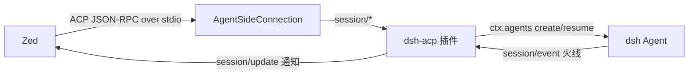

# dsh-acp 技术文档

本文档描述 `dsh-acp` 的实现细节：架构、会话事件到 ACP 的映射、配置机制与能力边界。面向维护者与需要深入理解行为的用户。

## 架构

`dsh-acp` 是一个 dsh **profile bundle**（声明 `dsh.bundle.patch`），叠加在 `dsh-base` 上运行。`dsh --profile acp` 启动后，插件 `apply(ctx, config)` 在进程 stdin/stdout 上打开一个 ACP `AgentSideConnection`，通过 `ctx.agents` 创建/驱动持久 Agent 会话。



- stdout 只承载 ACP 帧；诊断信息走 `ctx.logger` → stderr。
- 模型路由、沙箱、审批、持久化、子代理注册表等宿主能力由 `dsh-base` 提供；工具与 persona 来自 agent preset 的 standing mount（见下文）。

## 会话事件 → ACP 映射

插件订阅 `session/event` 火线，按事件类型翻译：

| dsh 会话事件 | ACP 输出 |
|---|---|
| `assistant/chunk`（`text-delta`） | `agent_message_chunk`（token 逐字流式） |
| `assistant/chunk`（`reasoning-delta`） | `agent_thought_chunk`（思考流） |
| `assistant/message` | 兜底：某一步没有流式增量时才回退提交文本，避免重复 |
| `tool/call` | `tool_call`（kind、位置跳转、原始入参） |
| `tool/result` | `tool_call_update`（completed/failed，结果文本或结构化 diff） |
| `tool/call`/`tool/result`（bash/pwsh） | terminal 内容（见「bash 终端」） |
| `turn/end` | 关联到 in-flight prompt 的结束原因，映射为 ACP `stopReason` |

其他生命周期事件通过以下订阅完成：

- `agent/inbox/claimed` —— 把提交的消息 id 关联到其 turn，用于精确结算。
- `agent/error` —— 相关 turn 失败时立即拒绝 `session/prompt`。
- `approval/request` —— 把 dsh 的一次性审批（沙箱越权等）以 `session/request_permission` 交给客户端（allow_once / reject_once）。

### 向用户提问（ask_user_question → elicitation）

agent preset（standard / code / cordis）自带 `@deepseek-ai/dsh-tool-ask-user`，其 `ask_user_question` 工具会阻塞在 `ctx.userQuestions` seam 上。桥接层注册该 seam 的 provider，把提问翻译成 ACP **表单 elicitation**（`elicitation/create`，form 模式）——参考 [codex-acp 的 elicitation 处理](https://github.com/agentclientprotocol/codex-acp)（其 app-server `tool/request_user_input` 同样映射为 form elicitation）：

| dsh 问题形态 | elicitation form 属性 |
|---|---|
| 带选项（单选） | `{type: 'string', oneOf: [{const, title}]}`，选中的 label 回到 `selected` |
| `multi_select: true` + 选项 | `{type: 'array', items: {type: 'string', enum}}`，多选 labels 回到 `selected` |
| 无选项（自由文本） | `{type: 'string'}`，输入文本回到 `custom` |
| 任意选项题 + 自定义 | 附加可选自由文本字段 `{id}__other`（title `Other`，description 同 codex：*Type your own answer instead of choosing an option above.*）——这是 dsh 自定义答案通道（web UI 对任何选项题都提供自定义输入）在 ACP 表单上的呈现 |

- **required 语义**：无选项题进 `required`；选项题的主字段**不**进 `required`——用户可以不选任何选项、只填 Other 输入框（codex 的 `isOther` 场景）。`{id}__other` 恒为可选。
- **答案回填**（对齐 web UI）：单选时 Other 文本**取代**已选选项（`custom` 非空则 `selected` 清空）；多选时 `selected` 保留勾选、Other 文本作为 `custom` 并存；只填 Other 不选选项 → `{selected: [], custom}`。未作答的问题（accept 缺字段）直接省略。
- 单问题时 `message` 直接用问题文本，多问题用 `Input requested (N questions)`。
- `tool/call`（`ask_user_question`）时把 callId 压入记录的 FIFO 队列，elicitation 请求携带 `toolCallId`，让 IDE 把问题模态框挂到已渲染的工具卡片上；`tool/result` 时清理未消费的 callId（工具在提问前报错/被中断的场景）。
- **能力门控**：客户端在 `initialize` 里声明 `clientCapabilities.elicitation.form` 才启用；未声明（或 `elicitation/create` 返回 method-not-found）时工具立即失败并给出自解释错误（`ELICITATION_UNSUPPORTED`：客户端不支持提问，把未决问题或决策并入最终结果），而不是让回合挂起。与 web UI 的语义保持一致：`decline`/`cancel` → `ASK_CANCELLED`，回合取消（abort signal）→ `ASK_ABORTED`。
- 该 capability 在 SDK 0.25.1 中属 UNSTABLE 通道（`unstable_createElicitation`），但 wire 方法名 `elicitation/create` 与现行规范一致。

### 斜杠指令

`session/new` / `session/load` 后，通过 `ctx.commands.list(agent)` 枚举该 agent 的 dsh 指令，发 `available_commands_update`（`AvailableCommand` = `{name, description, input?}`）。用 `setTimeout(0)` 延后发送，确保落在 `session/new`（或 load）响应之后——Zed 会忽略未知 sessionId 的通知。

`session/prompt` 收到以 `/` 开头的文本时，先经 `ctx.commands.execute(agent, line, signal)` 分发：命中的指令在命令平面执行，**不进入模型历史**，其结果文本以 `agent_message_chunk` 回显给客户端，随后回合以 `end_turn` 结束（不驱动模型回合）。这使 `/plan` 能真正开启 plan mode——否则 `/plan` 会被当作普通文本交给模型，导致后续 `exit_plan_mode` 因「不在 plan mode 中」而失败。未命中或非法 `/` 文本不是命令，仍按普通模型输入回退。带消息的命令（如 `/plan <message>`）由处理器自行 `agent.steer()` 追加模型可见工作，桥接层在响应前等待该回合收敛。

### 结构化 diff

- `write`/`edit` 优先取 dsh 工具自带的 `tool/result.meta.diffs`（已算好 hunk diff）。
- `str_replace_editor` 无该 meta，故在 `tool/call` 时对目标文件做快照、`tool/result` 时再读比对。
- `edit`/`str_replace_editor` 的卡片位置按 `old_string`/`old_str` 在编辑前快照中的唯一匹配推断 1-based 行号；歧义（多次匹配）时不带行号。

### bash 终端

bash/pwsh 以 terminal 内容呈现：

- `tool_call`：`content: [{type:'terminal', terminalId}]` + `_meta.terminal_info`（terminal_id + cwd），命令作为卡片标题，`kind: 'execute'`。
- `tool_call_update`：`_meta.terminal_output`（完整输出）+ `_meta.terminal_exit`（退出码 + signal）。

输出与退出码优先取 `tool/result.meta`（`card: 'terminal'` 时读 `meta.output`/`meta.exitCode`/`meta.signal`）；非 terminal 情况（错误/后台任务）回退到渲染文本。

> 注意：dsh 会话事件里 bash **没有逐块流式输出**（仅 `tool/call` → `tool/result` 两个事件），因此是「执行完一次性填充终端」，非 token 级实时滚动。

### 上下文占用圆环（usage_update）

客户端状态栏的上下文小圆环由 `session/update { sessionUpdate: 'usage_update', used, size }` 驱动（ACP `UsageUpdate`：`size` = 上下文窗口总 token 数，`used` = 当前已用 token 数）：

- **数据源**：`ctx.sessionProjections.snapshot(session).values.contextPressure`（dsh-token-meter 的 provider 锚定投影）——`used = projectedTokens ?? pressureTokens`，`size = contextWindow`。与 dsh 自身 Web UI 的上下文占用统计同源，压缩（compaction）与模型切换会立即反映，无需等下一次 provider usage 上报。
- **触发时机**：`assistant/message`、`tool/result`、`turn/end` 后各推一次；`session/load` 时从持久化投影播种；`set_config_option(model)` 后刷新（模型切换可能改变窗口大小）。
- **静默规则**：分子或分母未知（新会话首个请求之前）时不发，圆环在第一次上报后点亮。

### todo 列表（plan）

dsh 的 `todo_write` 工具（agent preset 自带）以整表快照的形式追加 `todo/write` 会话事件（`{todos: {content, status}[]}`，`status ∈ pending / in_progress / completed`）。桥接层把它翻译成 ACP `plan` 更新（`sessionUpdate: 'plan'`，稳定 v1 通道，Zed 等客户端将其渲染为任务清单/计划卡片）：

```json
{
  "sessionId": "...",
  "update": {
    "sessionUpdate": "plan",
    "entries": [
      { "content": "分析现有代码结构", "priority": "medium", "status": "in_progress" }
    ]
  }
}
```

- **整表替换**：每次 `todo/write` 都发送完整列表（ACP 要求每次更新携带全部条目，客户端整体替换），与 Web UI 的 `todos` 投影（last-write-wins）语义一致。
- **字段映射**：`content`、`status` 直接透传（状态词表一致）；`priority` 是 ACP 必填字段而 dsh todo 没有优先级，统一填 `medium`。
- **回合边界**：`turn/start` 时发送空 `entries` 清空清单——与 Web UI「新回合开始隐藏已完成清单」的行为对齐（`turn/end` 保持清单可见）。仅在确实发送过 plan 之后才发清空，从未写过 todo 的会话不产生多余帧。
- **会话回放**：`session/load` 时对 `todo/write` / `turn/start` 事件做同一折叠（整表覆盖、turn/start 清空），只发**一条**最终的 plan 更新；折叠结果为 null（从未写过或被 turn/start 清空）则不发送。
- **线格式说明**：使用稳定通道 `sessionUpdate: 'plan'`（扁平 `entries`）而非 UNSTABLE 的 `plan_update` 包装格式——Zed 的 ACP 客户端只匹配前者并渲染（后者会被静默忽略）。

## 会话配置

`session/new` / `session/load` 返回 `configOptions`（Zed 渲染为下拉选择器），从左到右：

| id | category | 来源 |
|---|---|---|
| `permission` | `permission` | `ctx.permissionPresets`（read-only / workspace-write / danger-full-access）；缺省回退 `ctx.sandboxPolicy` 三档沙箱模式 |
| `model` | `model` | `ctx.llm.listProviders`/`listModels`；经 `installModelSelection` 运行时切换 |
| `thought_level` | `thought_level` | `ctx.llm.resolveModelInfo().reasoning.efforts`；切换 `selectionRef.current.reasoningEffort`。无 reasoning 元数据的模型回退到规范级别表；模型未声明 `defaultEffort` 时选择器额外提供首项 `provider-default`（显示用，请求守卫会剥离，不向模型发送任何 effort——与 Web UI 的「Provider default」一致），默认值**永不**回退到 `off` |

同时返回 `models`/`modes` 字段（供非 Zed 的 ACP 客户端使用）。**Zed 在 `configOptions` 存在时会忽略 `models`/`modes`**，因此所有 Zed 可见的选择器都必须进 `configOptions`。

### Agent preset（4 模式）

preset 是**进程级部署字段**，不是会话选择器：由 `DSH_ACP_PRESET` 环境变量（或 `acp` 行 `config.preset`）注入，空则回退 `standard`。4 个可选值：`standard`（标准）/ `code`（PTC）/ `minimal`（极简）/ `cordis`（创造）。

实现：`cordis.patch.yml` 禁用 23 个宿主平面「模型面向」行（工具、提示段、委派工具），挂载 `dsh-agent-presets`（默认 `standard`）；CLI 会自动注入随安装的 preset 根目录。`session/new`/`session/load` 在 factory 的 `setup(agentCtx)` 里调用 `agentPresets.mount(agentCtx, presetId)`，整个进程统一用一个 preset 组合。

## 会话历史

- `session/list` → `ctx.sessionPersistence.list()` 枚举持久化会话（cwd + `createdAt` 近似 `updatedAt`，游标分页）。
- `session/load` → 校验持久化 header → 释放同 id 在线会话 → `ctx.agents.resume` → 回放转录（user/assistant 消息、工具卡片；todo 历史折叠为一条 plan 更新）后再应答。
- `session/delete` → 释放在线会话 + 删除持久化产物（seam 无删除 API，用 `locate` + `rmSync` 尽力而为），幂等。

## 能力边界

- 不支持会话 **fork**（load / list / delete / resume 均已支持）。
- Agent preset 为进程级字段，会话内不可切换。
- 会话列表用 `createdAt` 近似 `updatedAt`，暂不提供标题。
- 仅基线 prompt（文本 + `resource_link`；图片/音频/embedded resource 会拒绝）。
- 不回传会话标题等（仍属日志/演示层）；usage 与 todo 列表已分别通过 `usage_update` / `plan` 回传。
- 单个 `cwd`，不支持 `mcpServers` 和 `additionalDirectories`。
- `ask_user_question` 依赖客户端 `elicitation.form` 能力；不具备时工具报错而不是静默空答（见上）。

## 目录结构

```
dsh-acp/
  package.json          # dsh.bundle.patch 声明 + 依赖 + 仓库元信息
  cordis.patch.yml      # bundle patch：persona、关闭 HMR、agent 平面迁到 preset、挂载 acp
  lib/index.js          # ACP 服务端插件（apply/inject）
  smoke-test.mjs        # 协议冒烟测试（mock 服务，不触模型栈 / $DSH_HOME）
  README.md             # 英文 README
  docs/
    README.zh.md        # 中文 README
    technical.md        # 本文档
```

## 验证

```bash
# 查看组合结果，确认 acp 插件已挂载
dsh --profile acp --dump-config | grep -A4 '"acp"'

# 用 stdio 手工发一帧 initialize（Ctrl-D 结束输入）
printf '%s\n' '{"jsonrpc":"2.0","id":1,"method":"initialize","params":{"protocolVersion":1,"clientCapabilities":{}}}' | dsh --profile acp

# 跑协议冒烟测试（不触模型栈）
node smoke-test.mjs
```

## 参考

- [Agent Client Protocol](https://agentclientprotocol.com)
- 官方实现：[`@deepseek-ai/dsh-acp`](https://github.com/deepseek-ai/deepseek-harness/tree/master/packages/acp/acp) 与 [examples/acp-agent](https://github.com/deepseek-ai/deepseek-harness/tree/master/examples/acp-agent)
- [`pi-acp`](https://github.com/svkozak/pi-acp)
