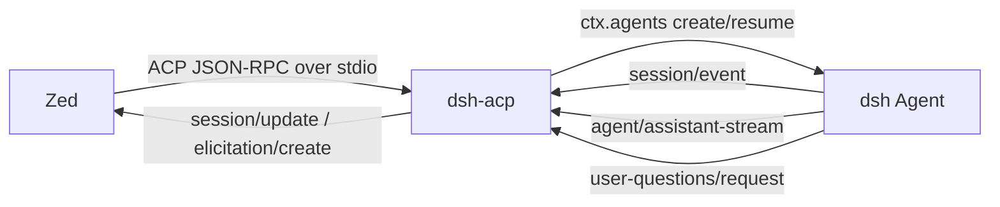

# dsh-acp 技术文档

本文档描述 `dsh-acp` 在 `dsh 0.2.0-rc.2` 上的实现细节、ACP 映射、profile 组合、配置与边界。面向维护者和需要深入理解行为的用户。

## 定位与架构

新版 dsh 随附的 `@deepseek-ai/dsh-acp` 是 automation-only server。本仓库在相同标准协议上提供面向 Zed 的 superset：

- 保留标准 session、MCP、模型选择和权限能力，自动化客户端仍可直接使用。
- 增加 plan/todo、命令、elicitation、丰富工具卡片、diff、terminal、usage、历史回放和 delete 扩展。
- 作为 dsh profile bundle 叠加在 `dsh-base` / `dsh-acp-app` 上运行。


```mermaid
flowchart LR
  Zed -->|ACP JSON-RPC over stdio| Bridge[dsh-acp]
  Bridge -->|ctx.agents create/resume| Agent[dsh Agent]
  Agent -->|session/event| Bridge
  Agent -->|agent/assistant-stream| Bridge
  Agent -->|user-questions/request| Bridge
  Bridge -->|session/update / elicitation/create| Zed
```

内部模块：

- `src/index.ts`：Cordis plugin、ACP connection、session registry、标准方法和权限审批
- `src/session.ts`：单个 Agent 的 preset/MCP 组合、prompt 准入、更新顺序、历史回放和 teardown
- `src/model-control.ts`：provider/model/reasoning config options 与 turn pinning
- `src/content.ts`：ACP 文本/图片 prompt 准入与 assistant block 投影
- `src/mcp.ts`：stdio / Streamable HTTP MCP 声明校验与 Agent-scoped 挂载
- `src/updates.ts`：session event → ACP update，包括 tool card、diff、terminal 和 plan
- `src/elicitation.ts`：稳定 `elicitation/create` 到 dsh user-questions 的适配

stdout 只承载 ACP 帧；诊断通过 `ctx.logger` 写入 stderr。

## Profile 组合

`cordis.patch.yml` 做四件事：

1. 禁用 base 中宿主平面的 model-facing rows，防止它们越过 preset 进入 Agent。
2. 禁用官方 `acp` 与 `acp-app-startup`。
3. 用唯一 ID 挂载官方 `@deepseek-ai/dsh-acp-app` startup provider 和本仓库 bridge。
4. 挂载 `agent-preset-registry`，以及创造模式所需的 `cordis-host-runner` 和 `tool-cordis/host`。

使用唯一 startup/bridge ID 后：

- 全新 `dsh --profile acp` 不会出现两个 stdout server。
- 旧版仅含 `dsh-base + dsh-acp` 的 profile 也能继续工作；缺失的官方 row 只产生跳过警告。
- Zed 的现有 command/args 不需要修改。

`package.json` 的 `dsh.bundle.patch` 按顺序加载：

```text
cordis.patch.yml
presets/standard.patch.yml
presets/ptc.patch.yml
presets/minimal.patch.yml
presets/cordis.patch.yml
```

## Agent preset

新版 preset 是普通 Cordis row：

```yaml
- id: preset-standard
  name: '@deepseek-ai/dsh-agent-preset'
  config:
    id: standard
    plugins: [...]
```

桥接层在 `ctx.agents.create/resume` 的 `setup(agentCtx)` 内调用 `agentPresets.mount(agentCtx, presetId)`。preset 在 Agent 发布前完成挂载；配置失败会回滚整个 session。

选择语义：

- `DSH_ACP_PRESET` 通过 patch 进入 `config.preset`。
- `session/new`：`config.preset ?? registry.defaultId`。
- `session/resume` / `session/load`：`config.preset ?? header.agentPreset ?? registry.defaultId`，保持原 session 的工具集。
- preset 是进程级部署字段，不是 ACP session selector。

内置模式：

- `standard`：标准编码工具、plan、todo、web、subagent。
- `ptc`：标准工具加 PTC presentation。
- `minimal`：持久 shell 与最小 persona。
- `cordis`：plugin manager、Cordis inspect 工具及两张创作 skill。

旧 `$DSH_HOME/.agent-presets/` 目录不再由 registry 扫描。

## 会话事件映射

桥接层订阅 `session/event`：

| dsh 事件 | ACP 输出 |
|---|---|
| `assistant/message` | 未从 live stream 发出的 text / reasoning，作为兜底 chunk；usage 可用时附带 `usage_update` |
| `tool/call` | `tool_call`，含 title、kind、path/line、rawInput；bash/pwsh 附带 terminal content |
| `tool/result` | `tool_call_update`，优先 structured diff，其次快照 diff，最后文本；terminal 使用 `_meta` 输出与退出码 |
| `todo/write` | 稳定 `plan`，整表替换 |
| `turn/start` | 若此前显示过 plan，则发送空 `plan` 清除 |
| `turn/end` | 关联 in-flight prompt，释放 turn route pinning |

另订阅：

- `agent/assistant-stream`：`start/chunk/end`；text/reasoning delta 实时发送，同时标记对应 turn/step，避免 committed message 重复。
- `agent/inbox/claimed`：把 ACP prompt 的 message id 关联到 Agent turn，并固定该 turn 的模型选择。
- `agent/error`：立即结算相关 prompt 失败。
- `approval/request`：转换为一次性 `session/request_permission`，只提供 `allow-once` / `reject-once`。
- `llm/adapters-updated`：刷新每个 session 的 config options。

## ACP 方法与配置

标准能力：

- `initialize`：通告 `loadSession`、list/resume/close/delete、HTTP MCP，以及动态 image prompt capability。
- `session/new`：创建 Agent、挂载 preset 和 MCP，持久化空 session，然后返回 config options。
- `session/list`：基于 persistence snapshots 做 newest-first keyset 分页。
- `session/resume`：验证持久 header/cwd/origin，重新挂载 MCP 和 preset，不回放历史。
- `session/close`：取消 prompt、等待 Agent idle、flush persistence、dispose Agent；持久数据保留。
- `session/prompt`：一次只允许一个 in-flight prompt；在准入时固定模型路由。
- `session/cancel`：取消 prompt admission 或当前 Agent activity。

编辑器扩展：

- `session/load`：行为类似 resume，但在响应前通过 `snapshotEvents()` 回放 user/assistant/tool/todo 历史。
- `session/delete`：关闭在线 session；若 persistence 实例暴露内部 `locate()`，删除其 artifact 目录。无删除接口时只记录诊断，不伪造底层删除保证。
- `session/set_config_option`：
  - `permission`：三档权限 preset/sandbox mode。
  - `model`：provider/model，返回的不透明 value 编码 `[provider, model]`。
  - `thought_level`：推理强度或 `provider-default`。
模型控制复用 `installModelSelection`：prompt 准入时 snapshot，inbox claim 后 pin 到 turn，turn/end 释放。因此并发修改只影响之后的 prompt。

## 图片与命令

图片 prompt：

- `initialize` 根据默认/部署 route 和 attachment service 动态决定 `image` capability。
- 准入时再次解析精确 route，要求其 `inputModalities` 包含 image。
- 图片先经 attachment `saveImages` 持久化；Agent message 只包含 attachment reference。
- 非法 MIME、非 canonical base64、超限批次或不可用附件均返回 caller-correctable error。

命令 prompt：

- `commands.list(agent)` 在 session/new、resume、load 后延迟到响应之后再通告，避免 Zed 丢弃未知 session 的通知。
- 已识别 slash command 通过 `commands.execute` 执行，不进入模型历史。
- image block 包装为 `{ type: 'image', data, mediaType }` 的 `CommandSubmitAttachment`；命令自己负责准入与拒绝。
- 未识别 slash 文本按普通 prompt 进入模型。

## 用户提问

dsh 的 `ask_user_question` 工具通过 agent-scoped `user-questions/request` waterfall 查询 answerer。桥接层仅在请求携带当前 bridge-owned Agent 时认领，否则调用 `next()` 让给其他 UI。

ACP 端使用稳定 `elicitation/create` form：

- 单选：`string + oneOf`
- 多选：`array<string>` + enum
- 自由文本：required string
- 选项题的 Other：可选 `${id}__other`
- `accept` 映射为 dsh answers；单选的 Other 替换选项，多选时与选项并存
- `decline` / `cancel` → `ASK_CANCELLED`
- abort signal → `ASK_ABORTED`
- 客户端未声明 form capability 或未实现方法 → `ELICITATION_UNSUPPORTED`

elicitation 带 `sessionId`，当请求提供 `wait.callId` 时同时带 `toolCallId`，让编辑器把表单附着到工具卡片。

## MCP

在 Agent 发布前解析并挂载客户端传入的 servers：

- stdio：`command` 必须为绝对路径，支持 args/env，并继承 session cwd。
- HTTP：仅支持 `http:` / `https:`，支持 headers。
- server name 会规范化；重复规范化名、非法 env/header、重复 key、SSE 或其他 transport 直接拒绝。
- 任一 server 初始化失败都会回滚尚未发布的 Agent。

MCP tools 进入 Agent scope；MCP resources/prompts 仍不由 DSH 消费。

## 历史与删除

`sessionPersistence` 提供 `stat/list` snapshot。`session/load` 在 resume 后读取 `session.snapshotEvents()`：

- user message：文本 + image marker
- assistant message：text / reasoning / image
- tool call/result：工具卡片与完成状态
- todo：折叠最后一次 `todo/write`，遇到 `turn/start` 清空

删除属于 ACP unstable extension。当前 JSONL backend 的内部 `locate()` 可提供 artifact 路径，因此 bridge best-effort 删除 session 目录；session persistence 的公开 seam 本身没有 delete API。

## 能力边界

- 一个 primary cwd；`additionalDirectories` 不支持。
- 不支持 session fork。
- MCP 仅消费 tools；resources/prompts 不支持。
- SSE MCP transport 不支持。
- 图片仅支持 PNG/JPEG/WebP/GIF，且依赖 attachment service 与支持图片的 model route。
- planner/todo 以 ACP `plan` 表示，不保证 IDE 提供相同的原生产品卡片。
- 某些旧 ACP 客户端专用扩展（例如自定义 `_meta` terminal 字段）仍为编辑器兼容层，不属于标准 ACP 保证。

## 目录结构

```text
dsh-acp/
  package.json             # bundle metadata、依赖、脚本
  cordis.patch.yml         # base 行、host runner、startup 与 bridge 组合
  presets/                 # standard/ptc/minimal/cordis 声明
  src/                     # strict TypeScript 源码
  lib/                     # 提交的 ESM、声明与 source map
  smoke-test.mjs           # hermetic in-process protocol smoke
  scripts/profile-smoke.mjs# 临时 DSH_HOME 中的真实 profile 验收
  docs/                    # 中文 README 与本文档
```

## 验证

```bash
# 类型检查
pnpm run typecheck

# 进程内协议烟测
pnpm test

# 真实 dsh profile 安装与 ACP 生命周期
pnpm run test:profile

# 发布验证：typecheck + smoke + lib 无陈旧差异
pnpm run verify
```

真实 profile 测试使用临时 `DSH_HOME`，不会读取或修改用户实际 profile。

## 参考

- [Agent Client Protocol](https://agentclientprotocol.com)
- 官方实现：[`@deepseek-ai/dsh-acp`](https://github.com/deepseek-ai/deepseek-harness/tree/master/packages/acp/acp)
- [`pi-acp`](https://github.com/svkozak/pi-acp)
